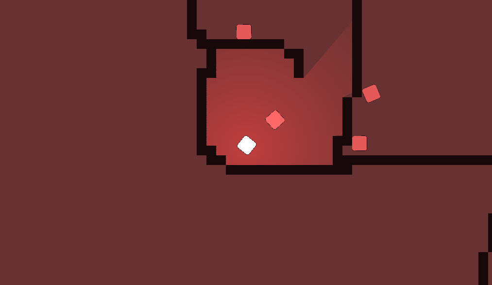
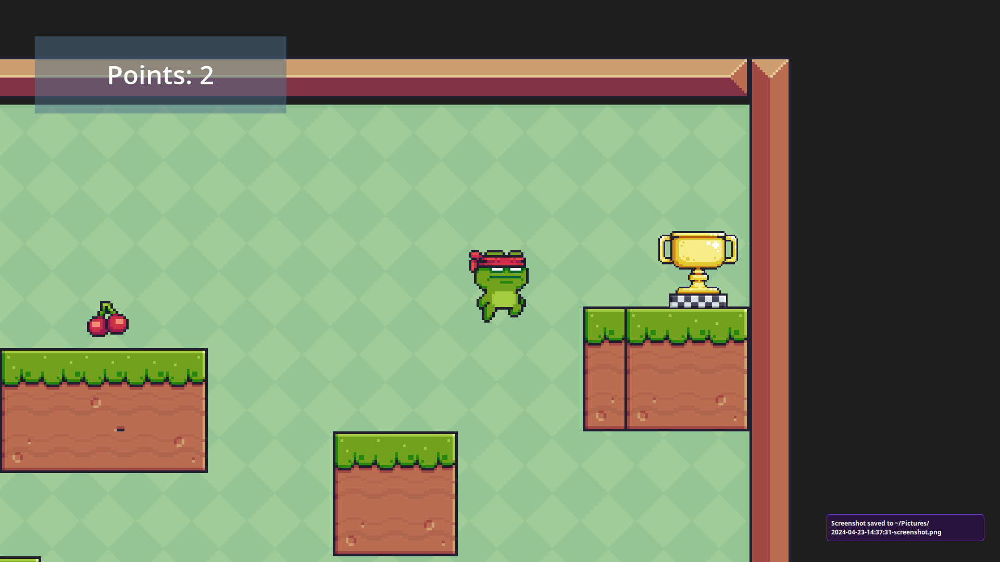

# archive-godot-learning

Those are some projects I made from December 20, 2022 to January 1, 2023.
In chronological order :

* **instancing**: Made following the "getting started" tutorial from Godot docs 
* **first_script**: Made following the "step by step" tutorial from Godot docs
* **dodge_the_creeps**: Made following the "Your first 2D game" tutorial from Godot docs
* **topdown_shooter**: I following this [video](https://www.youtube.com/watch?v=HycyFNQfqI0) in order to complete this project
* **2D Platformer (April 21)**: I followed this [tutorial](https://www.youtube.com/watch?v=5V9f3MT86M8). Although I did add a few more things
